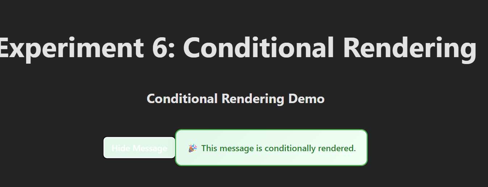
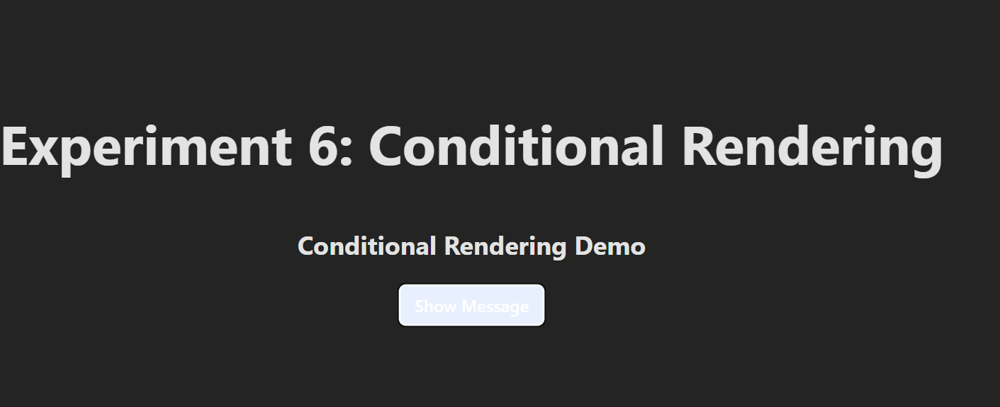

# Experiment 6: Conditional Rendering — Show/Hide a Component (CO3)

## Aim
Implement conditional rendering in React to show or hide a child component using a toggle button.

## Screenshots

Here’s a preview of the app:





## Prerequisites
- Node.js (LTS)
- npm
- Basic knowledge of React and hooks

## Setup (one-time)
```bash
npm create vite@latest react-toggle-demo
cd react-toggle-demo
npm install
npm install @vitejs/plugin-react --save-dev
